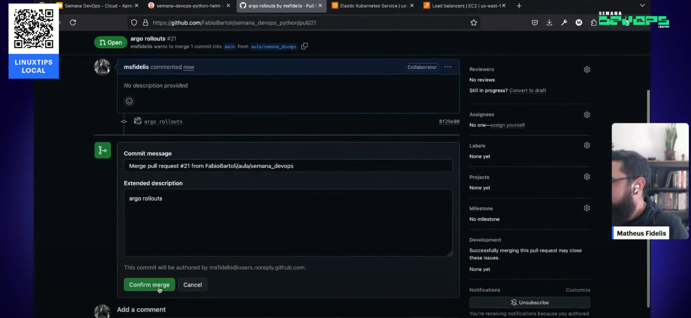

# Atenção! Este homem foi visto fazendo self-approve na sexta



# Metrics API

Esta é uma aplicação de exemplo,
criada apenas para ser usada como demonstação.


## Rodando em Container

```bash
docker build -t metrics -f Dockerfile .
docker run --net=host --rm -it metrics
```

## Rodando local com UV

Instale o UV.

```
pip install uv
# OU
curl -LsSf https://astral.sh/uv/install.sh | sh
```

```bash
uv sync  
uv run uvicorn main:app --host 0.0.0.0 --port 8081
```

## Outras branches

```bash
docker run --net=host --rm -it \
-e SIMULATE_HEAVY_LOAD=1 \
-e SIMULATE_UNHEALTHY_BEHAVIOR=1 \
-e SIMULATE_DELAY=1 \
metrics
```

- SIMULATE_HEAVY_LOAD faz com que o `/metrics` tenha spikes aleatorios e demore a responder de vez em quando, util para os testes de carga.

- SIMULATE_UNHEALTHY_BEHAVIOR faz com que aleatoriamente os health e ready probes retornem erro fazendo o k8s parar de enviar trafego para o POD.

- SIMULATE_DELAY faz com que o startup e o liveness tenham delay fazendo o k8s reiniciar o POD ou esperar para enviar trafego.


## Testando

```bash
uv run uv run pytest -v tests.py
# OU
uv run coverage run -m pytest -v tests.py
```

## Poe

Tarefas automatizadas com poe.

```bash
uv sync --all-groups
```

```console
❯ poe       
Poe the Poet (version 0.36.0)

Result: No task specified.

Usage:
  poe [global options] task [task arguments]

Global options:
  -h, --help [TASK]     Show this help page and exit, optionally supply a task.
  --version             Print the version and exit
  -v, --verbose         Increase command output (repeatable)
  -q, --quiet           Decrease command output (repeatable)
  -d, --dry-run         Print the task contents but don't actually run it
  -C, --directory PATH  Specify where to find the pyproject.toml
  -e, --executor EXECUTOR
                        Override the default task executor
  --ansi                Force enable ANSI output
  --no-ansi             Force disable ANSI output

Configured tasks:
  format                    Formata o código
  test                      Executa os testes
  coverage                  Executa os testes com cobertura de código
  locust                    Executa os testes de carga com Locust
  locust_all                Builda a imagem, executa o container em modo simulação e executa os testes de carga com Locust
  docker_build              Builda a imagem Docker
    --tag                   [default: latest]
  docker_run                Executa a imagem Docker
    --tag                   [default: latest]
  docker_simulation         Executa a imagem Docker com simulações de carga e comportamento inadequado
    --tag                   [default: latest]
  docker_simulation_daemon  Executa a imagem Docker com simulações de carga e comportamento inadequado em modo daemon
    --tag                   [default: latest]
```